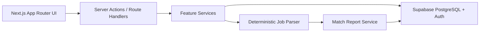

# Architecture

## Stack Decision

ApplyPilot uses a single Next.js full-stack codebase for the MVP. That keeps the first deployed version small enough to ship while still demonstrating frontend architecture, server-side data access, auth boundaries, database modeling, and tests.

The backend boundary lives in server actions, route handlers, feature services, and Supabase RLS. The app does not call an AI provider directly from UI components; job-analysis logic sits behind feature functions so deterministic parsing can later be replaced or enhanced by an AI provider.

## Feature Boundaries

- `applications`: application lifecycle, statuses, validation, CRUD services
- `candidate-profile`: candidate skills, projects, education, languages, links
- `job-analysis`: job-description parsing, skill extraction, match reports
- `dashboard`: response rate, status counts, frequent skills, recurring gaps
- `auth`: Supabase session management and route protection

## Data Ownership

Every user-owned table includes `user_id` directly or inherits ownership through `applications`. Supabase Row Level Security is enabled from the first migration so portfolio reviewers can see that data isolation is part of the architecture, not a late patch.

## MVP Architecture

## Initial Decisions

1. **Use deterministic parsing first.** This keeps tests stable and proves product value before AI enhancement.
2. **Use Supabase RLS.** User data isolation is enforced at the database boundary.
3. **Keep one deployable app.** A separate backend can be added later, but the MVP should ship quickly on Vercel.
4. **Use vertical feature folders.** Product areas remain easy to explain and test independently.
